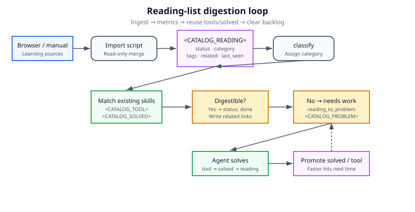
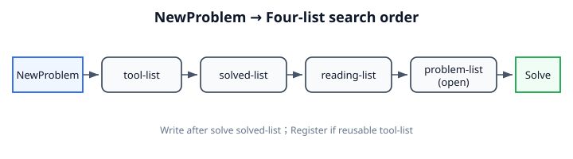
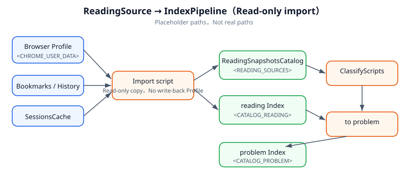
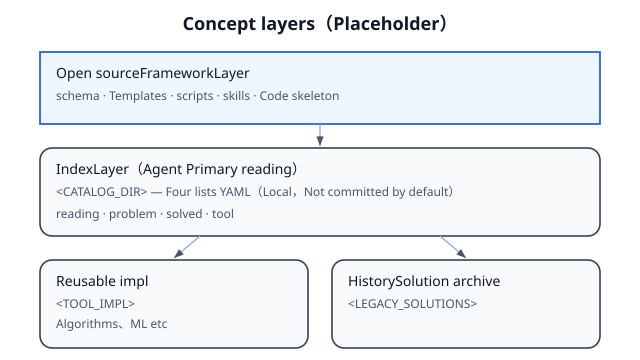
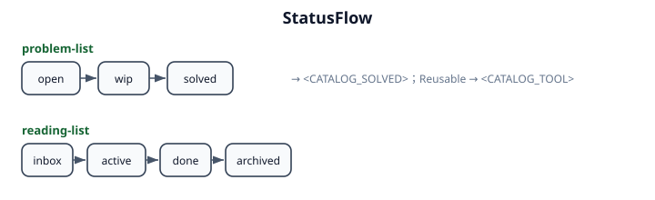

# Quanta Learn — Design

> Design v1.2 · reading-list digestion  
> Diagrams: SVG under `docs/images/` (placeholders, no local paths).

## Goal

Turn scattered bookmarks and history into an indexed backlog that can be matched against existing tools and solutions.

1. Ingest sources into a metric-bearing reading index
2. Drive digestion with status, category, tags, related
3. Reuse `tool-list` / `solved-list` before re-reading
4. Unsolved items go to `problem-list`; solved work feeds back into solved / tool



## Lists

| List | Role | Placeholder |
|------|------|-------------|
| reading-list | Main queue | `<CATALOG_READING>` |
| tool-list | Reusable tools | `<CATALOG_TOOL>` |
| solved-list | Prior solutions | `<CATALOG_SOLVED>` |
| problem-list | Hands-on backlog | `<CATALOG_PROBLEM>` |

| Flow | Order |
|------|-------|
| Digest reading | ingest → classify → match tool/solved → done or problem |
| Answer a question | tool → solved → reading → problem |



## Reading metrics

| Field | Use |
|-------|-----|
| `status` | inbox → active → done → archived |
| `category` | from `classify_reading_items.py` |
| `tags` | match tool / solved |
| `source` | chrome-bookmark / history / session / manual |
| `last_seen` | revisit priority |
| `related.*` | cross-links after hits |

Full schema: [catalog/schema.md](catalog/schema.md).

## Pipeline



| Step | Script | Output |
|------|--------|--------|
| 1 | `import_chrome_sources.py` | `<CATALOG_READING>` + snapshots |
| 2 | `classify_reading_items.py` | category / tags |
| 3 | `reading_to_problem.py` | `<CATALOG_PROBLEM>` |
| 4 | `sync_catalog_from_legacy.py` | tool / solved paths |

```bash
export CHROME_USER_DATA_DIR="<your-browser-profile-dir>"
python3 scripts/import_chrome_sources.py
python3 scripts/classify_reading_items.py
python3 scripts/reading_to_problem.py
python3 scripts/sync_catalog_from_legacy.py
```

## Layers



| Layer | Public | Local only |
|-------|--------|------------|
| Framework | schema, templates, scripts, skills | — |
| Index | field docs | `<CATALOG_DIR>/*.yaml` |
| Content | tool / solution skeletons | reading snapshots, auto problem bodies |

`bash scripts/init_local_catalog.sh` builds local catalogs from `*.yaml.example`.

## Problem kinds

| kind | Notes |
|------|-------|
| reading-derived | from a reading item |
| algorithm / debug / system-design | aligned with reading category |



## Code archives

| Placeholder | Content |
|-------------|---------|
| `<TOOL_IMPL>` | reusable implementations |
| `<LEGACY_SOLUTIONS>` | historical solutions |

`sync_catalog_from_legacy.py` indexes paths into tool / solved.
