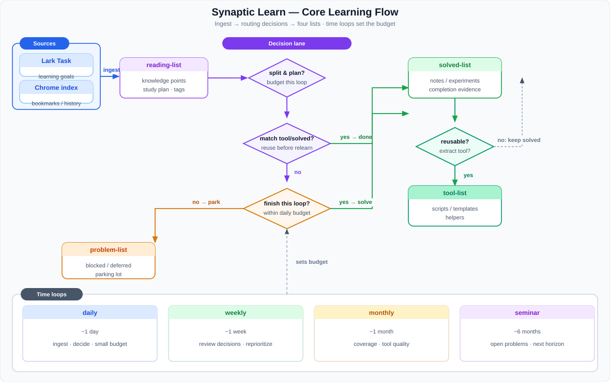

# Quanta Learn

An **accelerated learning** project: ingest tasks and reading material, digest them against a study plan, archive reusable tools, and keep running long-horizon review loops.

## Core flow



The diagram’s center lane is the **routing policy** (list transitions). It is not an LLM/agent API call graph.

1. **split & plan?** — turn intake into knowledge points / a study plan within this loop’s budget  
2. **match tool/solved?** — reuse first; if enough, mark reading `done` and link `related`  
3. **finish this loop?** — if not finishable soon, park in `problem-list`  
4. **reusable?** — after solve, extract into `tool-list` when it generalizes  

| List | Role |
|------|------|
| `reading-list` | Intake: materials from Lark tasks + Chrome reading index |
| `solved-list` | Finished notes / experiments / conclusions after a plan |
| `tool-list` | Reusable scripts / templates / helpers extracted from solved work |
| `problem-list` | **Short-term unblockable or stuck** items (parking lot, not a default drill queue) |

Review loops can be long:

| Loop | Cadence | Work |
|------|---------|------|
| daily | ~1 day | Ingest, tag, advance a small active budget, refresh `related` |
| weekly | ~1 week | Review progress, re-prioritize, flag stalled items |
| monthly | ~1 month | Coverage check, review needs, tool-candidate quality |
| seminar | ~6 months | Cross-domain summary, open problems, next horizon |

See [DESIGN.md](DESIGN.md) and [AGENTS.md](AGENTS.md).

## Current status (local)

Shipped:

- **Chrome source**: read-only bookmarks / history / sessions → `catalog/reading-list.yaml`
  - Tags: source + bookmark folder + domain
  - **Redaction**: emails, tokens, home paths, sensitive query params, URL credentials
  - **Blocklist**: patterns in `config/blocklist.local.txt` are dropped before the catalog
- Local catalog init, rule-based classify, dashboard
- Domain example: `domain = rlhf` (below)

Next:

- Lark Task OpenAPI ingest
- Knowledge-point split + study plan (OpenAI-compatible model)
- `daily | weekly | monthly | semiannual` CLI runner

## Quick Start

```bash
git clone https://github.com/fooSynaptic/quanta-learn.git
cd quanta-learn
python3 -m venv .venv && source .venv/bin/activate
pip install -r requirements.txt
bash scripts/init_local_catalog.sh
```

Chrome import (local profile; outputs are gitignored by default):

```bash
export CHROME_USER_DATA_DIR="${HOME}/Library/Application Support/Google/Chrome"
python3 scripts/import_chrome_sources.py
python3 scripts/classify_reading_items.py
```

Dashboard:

```bash
python3 dashboard/server.py   # http://127.0.0.1:8765/
```

## Domains

Content is partitioned by **domain**. Domains are not the product story.

| Domain | reading | solved | tool |
|--------|---------|--------|------|
| [rlhf](reading-list/rlhf-book/) | [reading-list/rlhf-book](reading-list/rlhf-book/) | [solved-list/rlhf-book](solved-list/rlhf-book/) | [tool-list/rlhf-book](tool-list/rlhf-book/) |

The `rlhf` domain holds RLHF-book entrypoints and experiment notes. Full trainers are **not** vendored; see placeholders under `tool-list/rlhf-book`.

## Documentation

| Document | Content |
|----------|---------|
| [DESIGN.md](DESIGN.md) | Dual sources, four lists, time loops |
| [AGENTS.md](AGENTS.md) | Agent protocol |
| [catalog/schema.md](catalog/schema.md) | Catalog fields (privacy / tags) |
| [docs/UI-DESIGN.md](docs/UI-DESIGN.md) | Dashboard UI |
| [docs/TODO.md](docs/TODO.md) | Backlog |
| [skills/auto-learn-agent/SKILL.md](skills/auto-learn-agent/SKILL.md) | Agent skill |

## Maintenance

```bash
# Chrome: User Data root or …/Default
export CHROME_USER_DATA_DIR="${HOME}/Library/Application Support/Google/Chrome"
# Optional: cp config/blocklist.example.txt config/blocklist.local.txt
python3 scripts/import_chrome_sources.py
python3 scripts/classify_reading_items.py
python3 scripts/reading_to_problem.py
python3 scripts/sync_catalog_from_legacy.py
python3 scripts/build_dashboard_stats.py
```

Do **not** commit local catalogs (`catalog/*.yaml`), Chrome snapshots, or auto-generated problem bodies.

## Dependencies

Python 3.10+:

```bash
pip install -r requirements.txt
pip install -r requirements-dev.txt
```

```bash
ruff check scripts dashboard tests tool-list
python3 -m pytest tests/ -q
```
