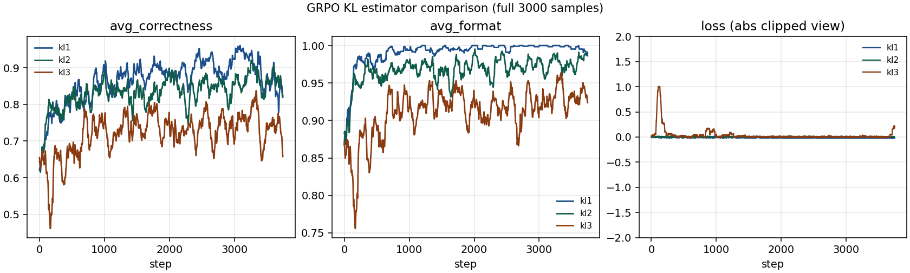
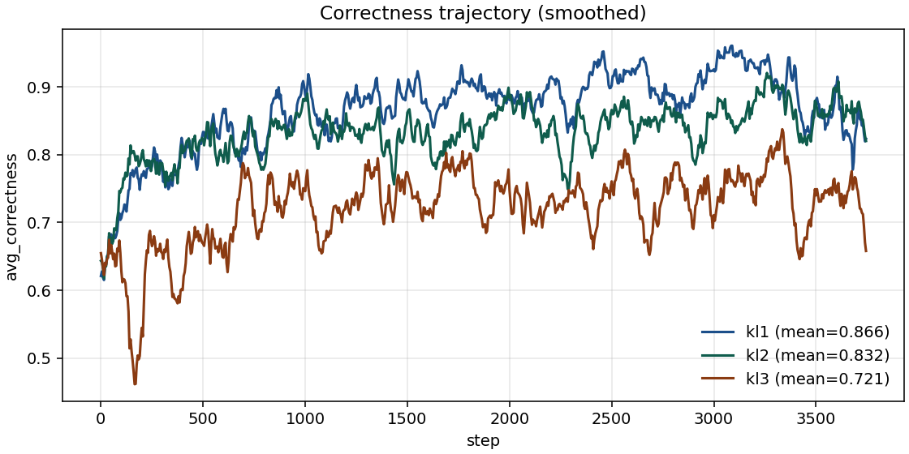
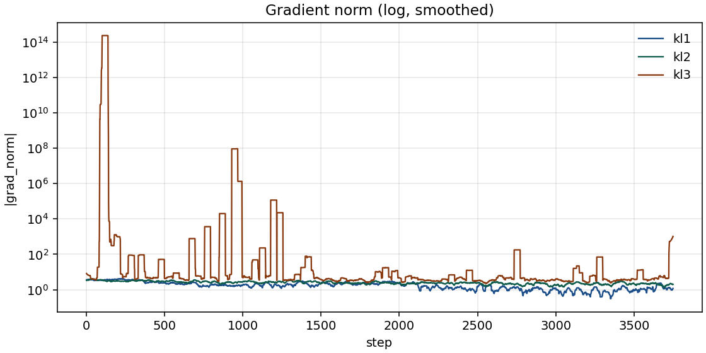

# Chapter 6 · Policy Gradients — Experiment Report

Maps to **Suggested Experiments** at the end of Chapter 6 (*Policy Gradient Methods*) and the companion `code/policy_gradients/` package.  
Tool placeholder: [`tool-list/rlhf-book/placeholders/policy_gradients/`](../../../tool-list/rlhf-book/placeholders/policy_gradients/).  
Hardware: Hopper (96GB HBM). Model: `Qwen/Qwen3-1.7B`. Task: `spell_backward` (reasoning-gym). Metrics stayed in local `metrics.jsonl` (W&B disabled).

## Book experiment ↔ this run

| Book item | Content | This run |
|-----------|---------|----------|
| 1 | GRPO on word reversal; watch within-group contrast | Baseline GRPO available; this report focuses on the KL study |
| 2 | REINFORCE / RLOO / GRPO estimator comparison | Not the main table this round (configs still in the pack) |
| 3 | Sweep `num_rollouts` / temperature / data.size / format_weight | Not run |
| 4 | Toy rewards → math (ORM / RS) | See Chapter 9 report |
| **Extension** | GRPO with `kl_estimator ∈ {kl1, kl2, kl3}` | ✅ **Full `data.size=3000` completed** |

Motivation: many write-ups prefer `kl3` (Schulman approx KL). I ran a matched GRPO head-to-head to check whether training with `kl3` is more stable or higher-scoring.

## Setup (KL comparison)

| Item | Value |
|------|-------|
| compare_group | `ch06.5-kl-comparison-20260731-161259` |
| Sole variable | `kl_estimator` |
| beta | `0.04` |
| lr | `5e-6` |
| sampling | temp `0.6` · top_p `0.95` · top_k `20` |
| rollout | prompts/step `4` · num_rollouts `8` |
| train | batch `2` · accum `4` · max_norm `1.0` · seed `42` |
| parallelism | 1 GPU per run |

| run_id | wall | status |
|--------|------|--------|
| `ch06.5_grpo_kl1_20260731-161259` | 5.74 h | 3000/3000 |
| `ch06.5_grpo_kl2_20260731-161259` | 8.51 h | 3000/3000 |
| `ch06.5_grpo_kl3_20260731-161259` | 8.63 h | 3000/3000 |

Configs: `policy_gradients/configs/grpo_kl{1,2,3}.yaml`.

## Results

### Correctness / format

| estimator | mean corr | early / mid / late | last100 | mean format |
|-----------|-----------|--------------------|---------|-------------|
| **kl1** | **0.866** | 0.811 / 0.889 / 0.897 | 0.871 | **0.991** |
| **kl2** | 0.832 | 0.804 / 0.835 / 0.858 | 0.868 | 0.967 |
| **kl3** | 0.721 | 0.678 / 0.740 / 0.744 | 0.744 | 0.911 |

Ranking was stable for the full trajectory: **kl1 ≥ kl2 ≫ kl3**.

### Loss / grad stability

| estimator | \|loss\|≥1e3 | \|grad\|≥1e3 | loss p95 / max | grad p95 / max |
|-----------|--------------|--------------|----------------|----------------|
| kl1 | 0 | 0 | 0.39 / 0.93 | 5.3 / 24 |
| kl2 | 0 | 0 | 0.46 / 0.80 | 5.0 / 15 |
| kl3 | **19** | **48** | 0.53 / ~2.5e11 | 14 / ~7e15 |

Most `kl3` spikes sit in the first third of steps (~42/48). `kl1` / `kl2` never hit `|x|≥1e2`.

## Curves







## Analysis

1. With `beta=0.04`, single seed, and spell_backward, using `kl3` directly in the training loss (`policy_loss + beta * kl`) underperforms `kl1` / `kl2` on both correctness and stability.
2. That disagrees with the common “`kl3` is stabler” story — at least for this educational recipe, where `exp(r)−1−r` blows up when `|log_ratio|` is large.
3. An early stop at ~25% already showed the same ranking; the full run confirms it.
4. Limits: one seed, no `beta` sweep. Next: smaller beta, or train with kl1/kl2 and keep kl3 as a diagnostic only.

## Reproduce

Full trainer is **not** in this repo (stub only under tool-list). Use upstream [natolambert/rlhf-book](https://github.com/natolambert/rlhf-book) `code/policy_gradients/`, with example YAML sketches in the [tool placeholder configs](../../../tool-list/rlhf-book/placeholders/policy_gradients/configs/).

```bash
export WANDB_MODE=disabled
cd code   # from upstream rlhf-book checkout
uv run python -m policy_gradients.train --config policy_gradients/configs/grpo_kl1.yaml
# swap config for kl2 / kl3
```

## Artifacts (this repo)

| path | notes |
|------|-------|
| `figures/*.png` | curves |
| `summary.json` | aggregate stats |
| [`tool-list/.../policy_gradients/`](../../../tool-list/rlhf-book/placeholders/policy_gradients/) | stub + config sketches |
