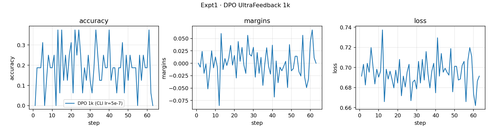
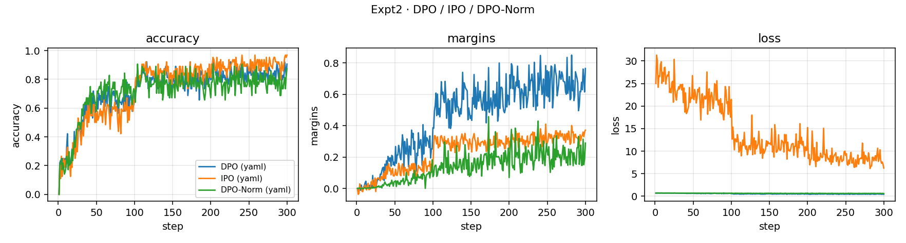
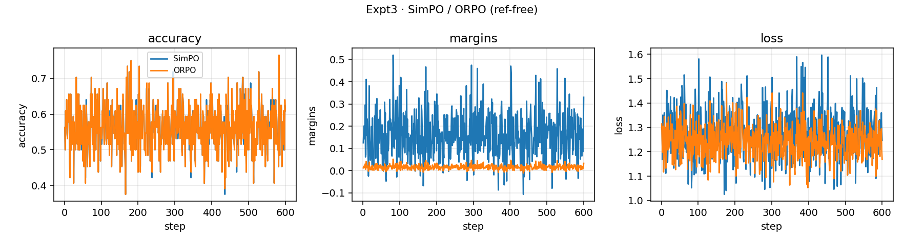
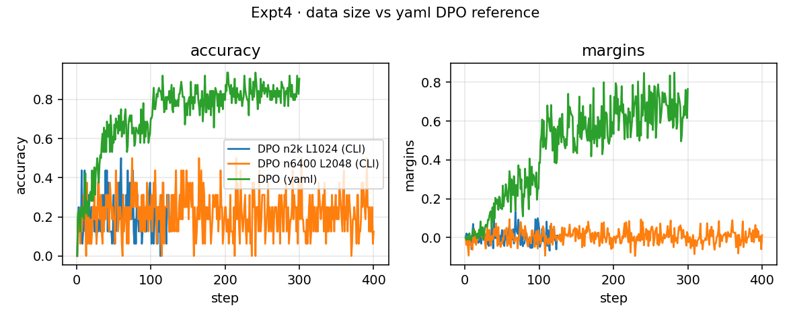

# Chapter 8 · Direct Alignment — Experiment Report

Maps to **Suggested Experiments** at the end of Chapter 8 (*Direct Alignment*) and `code/direct_alignment/`.  
Hardware: NVIDIA H20 (1 GPU per job). Model: `allenai/OLMo-2-0425-1B-SFT`. Data: UltraFeedback binarized preferences. W&B disabled; metrics in local `metrics.jsonl`.

Queue `queue_20260731-084642`: **8/8 jobs succeeded** (one mid-run DPO 1k collision on a busy GPU was discarded).

## Book experiment ↔ this run

| Book item | Content | This run |
|-----------|---------|----------|
| 1 | Small DPO sanity check | ✅ CLI DPO 1k |
| 2 | Compare DPO / IPO / DPO-Norm | ✅ full YAML |
| 3 | Reference-free variants (SimPO / ORPO) | ✅ full YAML |
| 4 | Vary data before changing the loss | ✅ CLI n2k / n6400 vs YAML DPO control |

## Setup

| Item | Value |
|------|-------|
| model | OLMo-2-0425-1B-SFT |
| data | `argilla/ultrafeedback-binarized-preferences-cleaned` |
| effective batch | 64 (`batch_size=8` × `grad_acc=8`), bf16 + grad checkpoint |
| full-YAML | `max_samples=6400` (SimPO/ORPO=12800), `max_length=2048`, 3 epochs |
| CLI small runs | `--loss dpo` defaults: `lr=5e-7`, 1 epoch (vs YAML `5e-6` / 3 ep) |

## Final-step summary

| Expt | Algo / variant | steps | hours | acc first→last (best) | margins first→last | loss last |
|------|----------------|------:|------:|-----------------------|--------------------|----------:|
| 1 | DPO 1k CLI | 63 | 0.04 | 0.00→0.00 (0.38) | 0.00→0.00 | 0.691 |
| 2 | DPO yaml | 300 | 3.27 | 0.00→**0.91** (0.94) | 0.00→**0.77** | 0.421 |
| 2 | IPO yaml | 300 | 3.39 | 0.00→**0.97** (0.97) | 0.00→0.37 | 6.230† |
| 2 | DPO-Norm yaml | 300 | 3.27 | 0.00→**0.88** (0.91) | 0.00→0.29 | 0.585 |
| 3 | SimPO | 600 | 5.26 | 0.56→0.61 (0.75) | 0.13→**0.33** | 1.247 |
| 3 | ORPO | 600 | 7.81 | 0.56→0.61 (0.77) | 0.01→0.03 | 1.170 |
| 4 | DPO n2k L1024 CLI | 125 | 0.17 | 0.00→0.13 (0.50) | 0.00→0.01 | 0.690 |
| 4 | DPO n6400 L2048 CLI | 400 | 1.13 | 0.00→0.13 (0.50) | 0.00→0.01 | 0.687 |

† IPO raw loss scale is not comparable to DPO — use accuracy / margins.

## Expt 1 · Small DPO (1k)



- CLI defaults (`lr=5e-7`, 1 epoch): final accuracy/margins collapse near zero; mid-run best acc≈0.38.
- Sanity only — not a stable preference run. Same data scale needs YAML-scale LR to move.

## Expt 2 · DPO / IPO / DPO-Norm



| | DPO | IPO | DPO-Norm |
|--|-----|-----|----------|
| last acc | 0.906 | **0.969** | 0.875 |
| last margins | **0.765** | 0.372 | 0.289 |

- All three improve accuracy; implicit reward margins move the right way.
- DPO opens the largest margin; IPO wins accuracy with a tighter margin and much larger raw loss.
- DPO-Norm (token-mean logprob, still with ref) sits in between and stays LR-sensitive.

## Expt 3 · Reference-free (SimPO / ORPO)



- Final accuracy ≈0.61 (best ~0.75–0.77) — far behind YAML DPO/IPO on the same model.
- **SimPO**: margins 0.13→0.33, correct direction but noisy; late accuracy gains are limited.
- **ORPO**: margins barely move (0.01→0.03); SFT/OR terms drop but preference signal is weak.
- Matches the chapter story: ref-free methods are pickier about logprob scale and LR.

## Expt 4 · Vary data before the loss



| Run | samples | max_len | lr / epochs | last acc | last margins |
|-----|--------:|--------:|-------------|----------|--------------|
| CLI n2k | 2000 | 1024 | 5e-7 / 1 | 0.125 | 0.009 |
| CLI n6400 | 6400 | 2048 | 5e-7 / 1 | 0.125 | 0.012 |
| YAML DPO (control) | 6400 | 2048 | **5e-6 / 3** | **0.906** | **0.765** |

- Growing `max_samples` / `max_length` under the weak CLI LR barely learns.
- Same 6400 samples with YAML (higher LR + 3 epochs) produces strong margins/accuracy.
- In this queue, **optimizer settings dominate data size**. A fair “data beats loss” study should freeze the YAML recipe and only sweep data.

## Checklist

| Check | Outcome |
|-------|---------|
| margins / accuracy move the right way | YAML DPO/IPO/DPO-Norm: yes; SimPO: weak yes; ORPO / CLI small: no or tiny |
| chosen vs rejected separation | strongest for YAML DPO |
| no obvious collapse in sampled text | OK in logged spot checks |
| DPO vs IPO vs Norm | all learn; compare margins / LR, not raw IPO loss |
| data sweep vs loss change | CLI data sweep failed; confounded by LR/epochs |

## Reproduce

```bash
export WANDB_MODE=disabled
cd code
# book scripts (names may wrap the module CLI)
uv run python -m direct_alignment.train --config direct_alignment/configs/dpo.yaml
# likewise ipo.yaml / dpo_norm.yaml / simpo.yaml / orpo.yaml
```

## Artifacts (this repo)

| path | notes |
|------|-------|
| `figures/expt{1-4}_*.png` | curves |
| `summary.json` | first/last/best per run |
